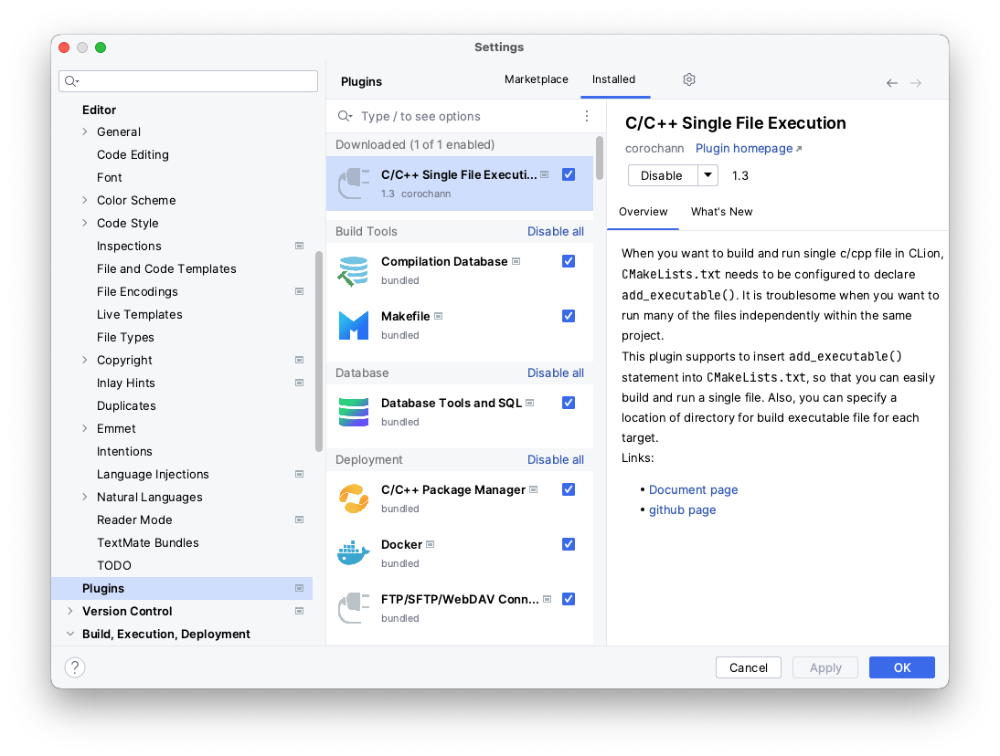
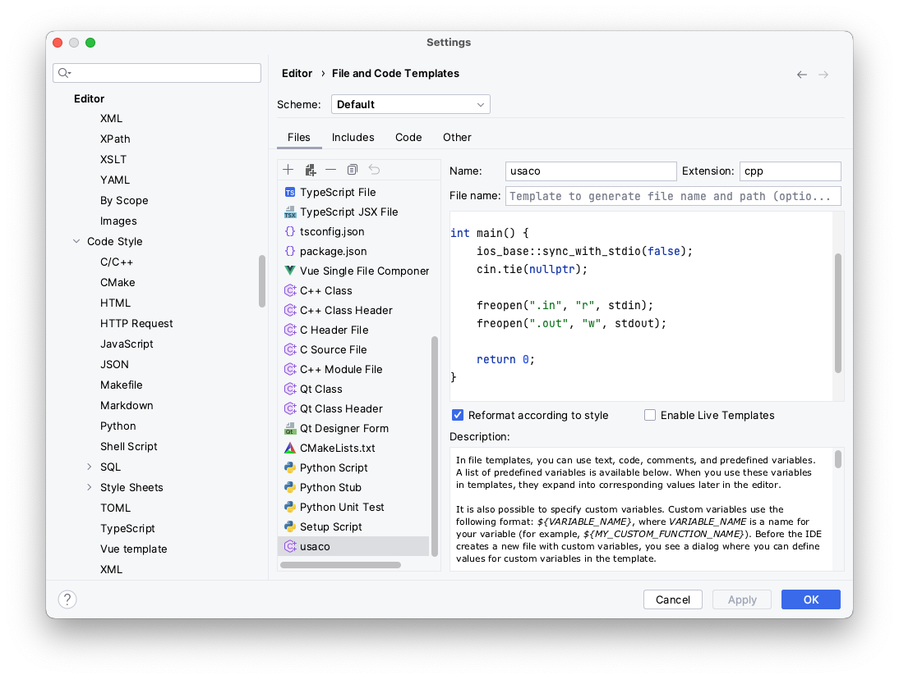

coding camp for USACO bronze

# CLion setup on macOS for USACO

* install xcode-select using terminal
  ```bash
  xcode-select --install
  ```
* if use linux (ubuntu), using terminal install the follow package
  ```bash
  sudo apt update
  sudo apt install build-essential
  ```  
* install "single file execution" plugin in CLion.
    
* create code template in CLion `editor > File and code templates`
    

    ```c++
    #[[#include]]# <bits/stdc++.h>

    using namespace std;

    int main() {
        ios_base::sync_with_stdio(false);
        cin.tie(nullptr);

        freopen(".in", "r", stdin);
        freopen(".out", "w", stdout);

        return 0;
    }
    ```
* include `<bits/stdc++.h>` in macOS and CLion.   
    * go to `/usr/local/include`, create a folder `bits`, then create a file `stdc++.h` in `bits` folder with the content in [this](https://gist.githubusercontent.com/reza-ryte-club/97c39f35dab0c45a5d924dd9e50c445f/raw/47ecad34033f986b0972cdbf4636e22f838a1313/stdc++.h) file.    
    * Add the following line in the `CMakeLists.txt` for the project inside CLion: 
    ```c++
    include_directories(/usr/local/include)
    ```
    * Now, you can use it with your `g++` on macOS


